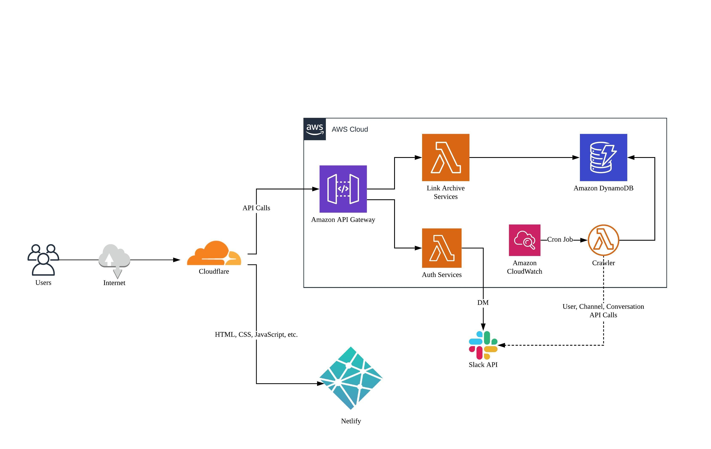

# Codesquad Link Archive

Codesquad Link Archive is an archive service for Codesquad Slack Users.
It provides users who use the free plan with links that cannot be viewed after a period.

## Architecture

## Project Stack

- Node.js
- TypeScript
- koa.js
- dynamodb-data-mapper-js
- Serverless Framework
- AWS
    - Lambda
    - API Gateway
    - DynamoDB
    - CloudWatch

